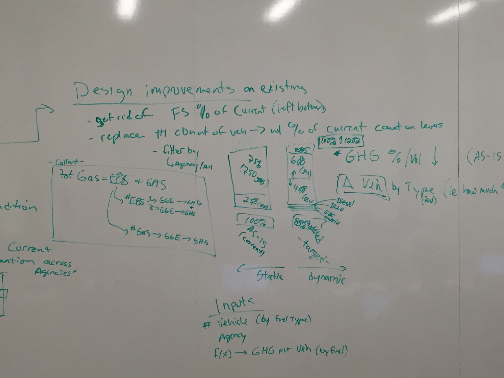
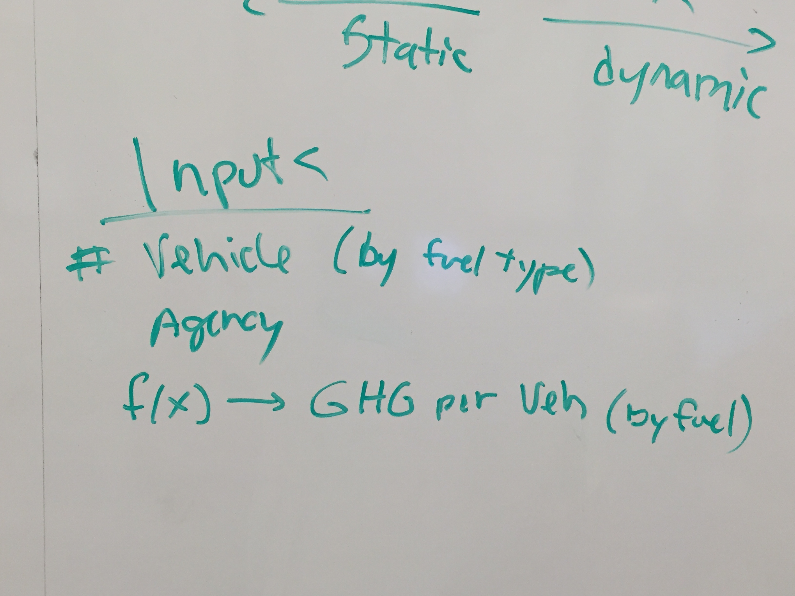

# Design

## UX Updates
  

  

  

## Cross-Agency Comparisons
We think it might inspire competition and otherwise motivate each agency to improve if they could see how they stack up to the other agencies.
  
### How their individual vehicles are used (the GHG emitted per vehicle)
  
  
  
### What percentage of their total vehicles are of a given type (i.e. transformation to alternative fuels)
  
  

